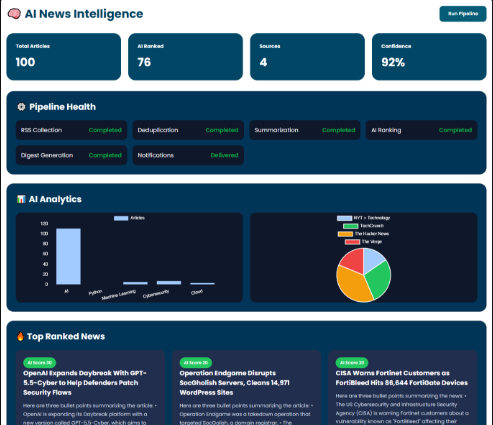

### 🧠 AI News Intelligence Dashboard

An automated AI-powered news intelligence platform that collects technology news from multiple RSS feeds, removes duplicates using semantic similarity, generates AI summaries, ranks articles by relevance, creates daily digests, and distributes reports through Email, Telegram, and Slack.

### 📸 Dashboard Preview




### 🚀 Features
#### 📰 News Collection
* Collects news from multiple RSS sources:
   * TechCrunch
   * The Hacker News
   * New York Times Technology
   * The Verge
#### 🤖 AI Summarization
* Uses Ollama + Llama models
* Generates concise article summaries
* Produces digest-ready content
#### 🔍 Semantic Deduplication
* Uses Sentence Transformers
* Detects duplicate stories via embedding similarity
* Removes redundant news automatically
#### 📈 AI Ranking Engine
* Scores articles based on:
   * AI
   * Python
   * Machine Learning
   * Cybersecurity
   * Cloud Computing
#### 📊 Analytics Dashboard
* Interactive charts
* Topic distribution analysis
* Source distribution analysis
* Pipeline monitoring
#### 📬 Notifications
* Email Digest
* Telegram Notifications
* Slack Alerts
#### 💾 Database Storage
* SQLite support
* Stores:
    * Articles
    * Digests
    * Rankings
#### ⏰ Automated Scheduling
* APScheduler integration
* Daily automated execution
### 🏗️ Architecture
```text
RSS Feeds
    │
    ▼
RSS Collector
    │
    ▼
Deduplication Engine
    │
    ▼
AI Summarizer (Ollama)
    │
    ▼
Article Ranking
    │
    ▼
Database Storage
    │
    ▼
Digest Generator
    │
 ┌──┼──────────────┐
 ▼  ▼              ▼
Email Telegram   Slack
```
### 📂 Project Structure
```text
app/
│
├── ai/
│   ├── deduplicator.py
│   ├── summarizer.py
│   └── ranker.py
│
├── collectors/
│   └── rss_collector.py
│
├── dashboard/
│   └── templates/
│       └── dashboard.html
│
├── database/
│   ├── db.py
│   ├── models.py
│   └── repository.py
│
├── digest/
│   └── generator.py
│
├── notifications/
│   ├── email_sender.py
│   ├── telegram_sender.py
│   └── slack_sender.py
│
├── services/
│   └── news_pipeline.py
│
├── config.py
├── main.py
└── scheduler.py
```
### ⚙️ Installation
#### Clone Repository
```text
git clone https://github.com/yourusername/ai-news-intelligence-dashboard.git

cd ai-news-intelligence-dashboard
```
#### Create Virtual Environment
```text
python -m venv venv
```
#### Linux / Mac
```text
source venv/bin/activate
```
#### Windows
```text
venv\Scripts\activate
```
#### Install Dependencies
```text
pip install -r requirements.txt
```
### 🔑 Environment Variables

Create a .env file:

```text
EMAIL_USER=your_email@gmail.com
EMAIL_PASSWORD=your_password

TELEGRAM_TOKEN=your_bot_token
TELEGRAM_CHAT_ID=your_chat_id

SLACK_WEBHOOK=https://hooks.slack.com/...

OLLAMA_URL=http://localhost:11434

DATABASE_URL=sqlite:///data/news.db
```
### Ollama Setup

Install Ollama:

```text
curl -fsSL https://ollama.com/install.sh | sh

Pull Llama model:

ollama pull llama3.2

Start Ollama:

ollama serve
```
### ▶️ Running the Application

Start FastAPI server:

```text
uvicorn app.main:app --reload
```
Application URLs:

API:
http://localhost:8000

Dashboard:
http://localhost:8000/dashboard

Analytics:
http://localhost:8000/analytics
### 🐳 Docker Deployment

Build image:

```text
docker build -t ai-news-dashboard .
```
Run container:

docker run -p 8000:8000 \
--env-file .env \
ai-news-dashboard
### 🐳 Docker Compose

Start services:

docker-compose up -d

Stop services:

docker-compose down
### 📊 API Endpoints
Health Check
GET /

Response:

{
  "message": "AI News Digest Running"
}
#### Execute Pipeline
GET /run

Runs:

* RSS Collection
* Deduplication
* Summarization
* Ranking
* Digest Generation
* Notifications
#### Dashboard
GET /dashboard

Returns web dashboard.

#### Analytics
GET /analytics

Returns topic and source analytics.

### ⏰ Scheduler

Run daily pipeline:

```text
scheduler.add_job(
    run_pipeline,
    "cron",
    hour=7,
    minute=0
)
```
Starts every day at 07:00 AM.

### 📈 Future Enhancements
* Multi-language support
* entiment analysis
* Trending topic detection
* User authentication
* PostgreSQL support
* Kubernetes deployment
* AI-generated newsletters
* Historical trend analysis
### 🛡️ Tech Stack

|Component | Technology |
|----------|------------|
|Backend | FastAPI |
|AI Summarization | Ollama |
|Embeddings | Sentence Transformers |
|Database | SQLite |
|ORM | SQLAlchemy |
|Scheduling | APScheduler |
|Dashboard | HTML/CSS/JS |
|Charts | Chart.js |
|Containerization | Docker |
### 🤝 Contributing

Contributions are welcome.

1. Fork the repository
2. Create a feature branch
```text
git checkout -b feature/new-feature
```
3. Commit changes
```text
git commit -m "Add new feature"
```
4. Push branch
```text
git push origin feature/new-feature
```
5. Open Pull Request
### 📄 License

This project is licensed under the MIT License.

### 👨‍💻 Author

Shoumen Das